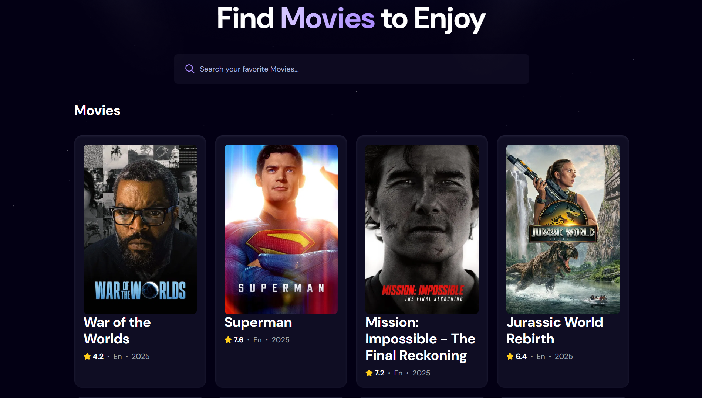

# 🎬 Movie Search App

A modern and responsive movie search application built with **React.js**. It uses the **TMDB (The Movie Database) API** to fetch real-time movie data and display it beautifully with infinite scrolling.

## 🌍 Live Demo

👉 [Click here to try the app](https://movix-app-personal.netlify.app/)

## 🖼️ Demo Preview

## ✨ Features

- 🔎 **Search Movies** by title using the TMDB API
- 📜 **Infinite Scrolling** – auto-load more movies as you scroll
- 🎭 **Movie Cards** with title, rating, language & release year
- 🖼️ **Fallback Images** when no poster is available
- ⚡ **Debounced Search** for smooth performance
- 🎨 Clean & responsive UI with gradient highlights
- 🛠️ Error handling with friendly messages

## 🚀 Tech Stack

- **React.js** (Hooks + Functional Components)
- **Vite** (fast build tool)
- **TMDB API** (for movie data)
- **CSS / Custom Styling**
